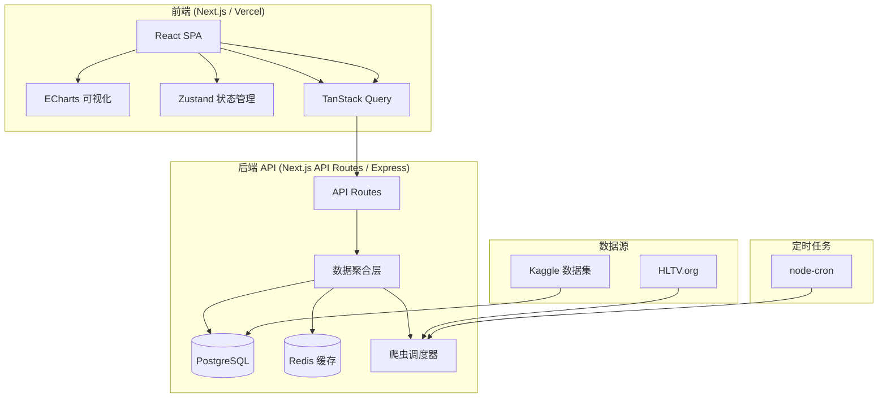
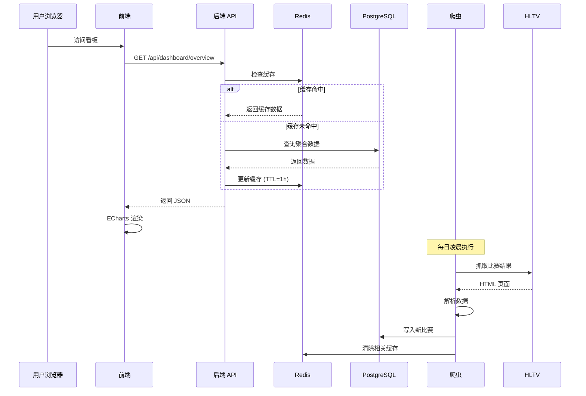

# 🦞 小龙虾-CS2-BP分析网站-数据看板设计

> **时间**：2026-06-05 15:52 CST
> **作者**：Subagent (章鱼 🐙)
> **状态**：初版完成
> **版本**：v1.0

---

## 目录

1. [项目背景与目标](#1-项目背景与目标)
2. [数据获取方案](#2-数据获取方案)
3. [数据结构设计](#3-数据结构设计)
4. [可视化看板设计](#4-可视化看板设计)
5. [技术选型](#5-技术选型)
6. [架构设计](#6-架构设计)
7. [MVP 与迭代路线](#7-mvp-与迭代路线)
8. [附录：伪代码与参考实现](#8-附录伪代码与参考实现)

---

## 1. 项目背景与目标

### 1.1 背景

CS2 职业比赛中，**BP（Ban/Pick）策略**是决定胜负的关键环节之一。当前 Active Duty 七图（2026年）为：

| # | 地图 | 加入时间 | 特点 |
|---|------|---------|------|
| 1 | **Ancient** | 2021 | 古迹风格，CT 略优 |
| 2 | **Dust2** | 经典 | 最均衡，T/CT 接近 50/50 |
| 3 | **Inferno** | 经典 | 香蕉道控制权争夺 |
| 4 | **Mirage** | 经典 | CT 优势明显 (~54%) |
| 5 | **Nuke** | 经典 | 立体结构，CT 优势 (~55%) |
| 6 | **Anubis** | 2024 (Active Duty) | 新图，T 优势 (~57%) |
| 7 | **Overpass** | 经典 | 工地图，CT 略优 |

### 1.2 目标

构建**第一层：数据看板**，提供以下核心能力：

1. **七图 CT/T 胜率总览** — 全局视角的地图平衡性
2. **战队地图池热力图** — 快速对比各战队地图强弱
3. **近期 BP 趋势图** — 追踪某队最近 N 场的 BP 模式变化
4. **数据自动更新** — 从 HLTV 定期获取最新比赛数据

### 1.3 目标用户

- CS2 职业战队分析师
- 电竞博彩/预测玩家
- CS2 内容创作者和社区

---

## 2. 数据获取方案

### 2.1 HLTV 数据获取方式对比

| 方式 | 难度 | 可靠性 | 速率限制 | 维护成本 | 推荐度 |
|------|------|--------|---------|---------|--------|
| **gigobyte/HLTV (Node.js)** | ⭐⭐ | ⭐⭐⭐⭐ | 有（Cloudflare） | 低（不再维护） | ⭐⭐⭐ |
| **hltv-api (Node.js)** | ⭐ | ⭐⭐⭐ | 有 | 低 | ⭐⭐⭐ |
| **自建 Playwright 爬虫** | ⭐⭐⭐⭐ | ⭐⭐⭐⭐⭐ | 可控制 | 中 | ⭐⭐⭐⭐ |
| **Apify 托管爬虫** | ⭐ | ⭐⭐⭐⭐ | 付费 | 低 | ⭐⭐⭐ |
| **Kaggle 数据集** | ⭐ | ⭐⭐⭐ (过时) | 无 | 需手动更新 | ⭐⭐ |
| **HLTV 官方 API** | ❌ | — | — | — | ❌ 不存在 |

### 2.2 推荐方案：混合策略

```
┌─────────────────────────────────────────────────────────┐
│                    数据获取策略                            │
├─────────────────────────────────────────────────────────┤
│                                                         │
│  初始数据：Kaggle CS2 HLTV 数据集 (7000+ 场比赛)          │
│  └─ 快速搭建 MVP，无需等待爬虫                            │
│                                                         │
│  增量更新：自建 Playwright + Node.js 爬虫                 │
│  └─ 每日定时抓取最新比赛结果                               │
│                                                         │
│  实时数据：gigobyte/HLTV 库 (按需)                        │
│  └─ 获取进行中比赛的实时比分                               │
│                                                         │
│  补充数据：HLTV 统计页面直接解析                           │
│  └─ 战队地图胜率、Pick/Ban 率                             │
│                                                         │
└─────────────────────────────────────────────────────────┘
```

### 2.3 数据获取频率

| 数据类型 | 频率 | 说明 |
|---------|------|------|
| 比赛结果 | 每日 1 次 | 凌晨低峰期抓取 |
| 战队排名 | 每周 1 次 | HLTV 排名每周更新 |
| 地图统计 | 每日 1 次 | 与比赛结果同步 |
| 进行中比赛 | 每 5 分钟 | 仅大型赛事期间 |
| 历史数据 | 一次性 | 导入 Kaggle 数据集 |

### 2.4 缓存策略

```
┌──────────────┐     ┌──────────────┐     ┌──────────────┐
│  请求到达      │────▶│  检查缓存      │────▶│  缓存命中？    │
└──────────────┘     └──────────────┘     └──────┬───────┘
                                                  │
                                    ┌─────────────┴─────────────┐
                                    ▼                           ▼
                            ┌──────────────┐           ┌──────────────┐
                            │  返回缓存数据   │           │  触发数据更新   │
                            └──────────────┘           └──────┬───────┘
                                                               │
                                                               ▼
                                                       ┌──────────────┐
                                                       │  爬虫抓取      │
                                                       │  → 解析       │
                                                       │  → 存入 DB    │
                                                       │  → 更新缓存    │
                                                       └──────────────┘
```

**缓存过期时间**：
- 比赛结果：1 小时
- 战队统计：6 小时
- 地图胜率：6 小时
- BP 趋势：1 小时

### 2.5 Cloudflare 反爬对策

HLTV 使用 Cloudflare 保护，需要：
1. **使用 Playwright/undetected-chromedriver** 模拟真实浏览器
2. **随机 User-Agent** 轮换
3. **请求间隔** 2-5 秒随机延迟
4. **代理池**（可选，大规模抓取时需要）
5. **2Captcha 服务**（遇到验证码时自动解决）

---

## 3. 数据结构设计

### 3.1 核心数据模型

```typescript
// ===== 战队 =====
interface Team {
  id: number;           // HLTV team ID
  name: string;         // 战队名称
  logo: string;         // Logo URL
  country: string;      // 国家
  ranking: number;      // 当前排名
  rankingPoints: number; // 排名积分
}

// ===== 比赛 =====
interface Match {
  id: number;           // HLTV match ID
  date: string;         // ISO date
  event: string;        // 赛事名称
  team1: Team;
  team2: Team;
  format: 'bo1' | 'bo3' | 'bo5';
  maps: MapResult[];    // 每张地图结果
  winner: number;       // 获胜方 team ID
}

// ===== 地图结果 =====
interface MapResult {
  mapName: string;      // 地图名
  team1CTRounds: number; // 队1 作为 CT 赢的回合
  team1TRounds: number;  // 队1 作为 T 赢的回合
  team2CTRounds: number;
  team2TRounds: number;
  winner: number;       // 该地图获胜方
  team1Side: 'CT' | 'T'; // 队1 起始阵营
}

// ===== 战队地图统计 =====
interface TeamMapStats {
  teamId: number;
  mapName: string;
  matchesPlayed: number;
  wins: number;
  winRate: number;       // 胜率
  ctWinRate: number;     // CT 胜率
  tWinRate: number;      // T 胜率
  pickRate: number;      // 被 Pick 率
  banRate: number;       // 被 Ban 率
  lastUpdated: string;
}

// ===== 全局地图统计 =====
interface GlobalMapStats {
  mapName: string;
  totalMatches: number;
  ctWinRate: number;     // 全局 CT 胜率
  tWinRate: number;      // 全局 T 胜率
  pickRate: number;      // 全局 Pick 率
  banRate: number;       // 全局 Ban 率
  mostPickedBy: Team[];  // 最常 Pick 该图的战队
  mostBannedBy: Team[];  // 最常 Ban 该图的战队
}

// ===== 交手记录 =====
interface HeadToHead {
  team1Id: number;
  team2Id: number;
  matches: Match[];
  mapStats: {
    [mapName: string]: {
      team1Wins: number;
      team2Wins: number;
    }
  };
  recentTrend: 'team1_hot' | 'team2_hot' | 'even';
}
```

### 3.2 数据库 Schema (PostgreSQL)

```sql
-- 战队表
CREATE TABLE teams (
  id INTEGER PRIMARY KEY,
  name VARCHAR(100) NOT NULL,
  logo_url TEXT,
  country VARCHAR(50),
  ranking INTEGER,
  ranking_points INTEGER,
  updated_at TIMESTAMP DEFAULT NOW()
);

-- 赛事表
CREATE TABLE events (
  id INTEGER PRIMARY KEY,
  name VARCHAR(200) NOT NULL,
  start_date DATE,
  end_date DATE,
  tier INTEGER  -- 1=顶级, 2=中级, 3=低级
);

-- 比赛表
CREATE TABLE matches (
  id INTEGER PRIMARY KEY,
  event_id INTEGER REFERENCES events(id),
  date TIMESTAMP NOT NULL,
  team1_id INTEGER REFERENCES teams(id),
  team2_id INTEGER REFERENCES teams(id),
  format VARCHAR(10),
  winner_id INTEGER REFERENCES teams(id),
  created_at TIMESTAMP DEFAULT NOW()
);

-- 地图结果表
CREATE TABLE map_results (
  id SERIAL PRIMARY KEY,
  match_id INTEGER REFERENCES matches(id),
  map_name VARCHAR(50) NOT NULL,
  team1_ct_rounds INTEGER DEFAULT 0,
  team1_t_rounds INTEGER DEFAULT 0,
  team2_ct_rounds INTEGER DEFAULT 0,
  team2_t_rounds INTEGER DEFAULT 0,
  winner_id INTEGER REFERENCES teams(id),
  team1_start_side VARCHAR(2) CHECK (team1_start_side IN ('CT', 'T'))
);

-- 战队地图统计（物化视图或缓存表）
CREATE TABLE team_map_stats (
  team_id INTEGER REFERENCES teams(id),
  map_name VARCHAR(50),
  matches_played INTEGER DEFAULT 0,
  wins INTEGER DEFAULT 0,
  win_rate DECIMAL(5,2),
  ct_win_rate DECIMAL(5,2),
  t_win_rate DECIMAL(5,2),
  pick_rate DECIMAL(5,2),
  ban_rate DECIMAL(5,2),
  last_updated TIMESTAMP DEFAULT NOW(),
  PRIMARY KEY (team_id, map_name)
);
```

### 3.3 Redis 缓存 Key 设计

```
# 格式：cs2:{namespace}:{key}
cs2:global:map_stats           # 全局地图统计
cs2:team:{id}:map_stats        # 某队地图统计
cs2:team:{id}:recent_bp        # 某队近期 BP 趋势
cs2:h2h:{team1}:{team2}        # 两队交手记录
cs2:matches:recent             # 最近比赛
cs2:matches:date:{YYYY-MM-DD}  # 某日比赛
```

---

## 4. 可视化看板设计

### 4.1 看板布局

```
┌─────────────────────────────────────────────────────────────┐
│  🦞 CS2 BP 分析看板                    [刷新] [设置] [关于]  │
├─────────────────────────────────────────────────────────────┤
│  ┌─────────────────────┐  ┌──────────────────────────────┐  │
│  │  七图 CT/T 胜率总览   │  │  战队搜索 / 筛选             │  │
│  │  (雷达图 / 柱状图)    │  │  [战队名输入] [地图筛选]     │  │
│  │                     │  │                              │  │
│  │  Ancient  CT:52%     │  │  热门战队：                 │  │
│  │  Dust2    CT:50%     │  │  [FaZe] [NAVI] [G2] [Vita] │  │
│  │  Inferno  CT:49%     │  │                              │  │
│  │  ...                 │  │                              │  │
│  └─────────────────────┘  └──────────────────────────────┘  │
├─────────────────────────────────────────────────────────────┤
│  ┌─────────────────────────────────────────────────────────┐│
│  │  战队地图池热力图                                         ││
│  │                                                         ││
│  │  战队    Ancient  Dust2  Inferno  Mirage  Nuke  Anubis  ││
│  │  FaZe     65%     72%     58%     68%    71%    55%    ││
│  │  NAVI     70%     55%     68%     72%    60%    62%    ││
│  │  G2       62%     68%     71%     55%    65%    70%    ││
│  │  ...                                                     ││
│  │  (颜色渐变: 红 < 50% < 黄 < 65% < 绿)                   ││
│  └─────────────────────────────────────────────────────────┘│
├─────────────────────────────────────────────────────────────┤
│  ┌─────────────────────┐  ┌──────────────────────────────┐  │
│  │  近期 BP 趋势        │  │  交手记录 / 预测             │  │
│  │  (折线图)            │  │                              │  │
│  │                     │  │  选择两队查看交手记录         │  │
│  │  Pick ──  Ban ──    │  │  [队A] vs [队B]             │  │
│  │                     │  │                              │  │
│  │  最近 20 场 BP 变化   │  │  H2H: 5-3 队A领先           │  │
│  └─────────────────────┘  └──────────────────────────────┘  │
└─────────────────────────────────────────────────────────────┘
```

### 4.2 组件一：七图 CT/T 胜率总览

**类型**：雷达图 + 柱状图双视图

**雷达图**：
- 7 条轴线，每条代表一张地图
- 两条数据系列：CT 胜率（蓝）、T 胜率（红）
- 中心 0%，外圈 60%
- 鼠标悬停显示具体数值

**柱状图（备选视图）**：
- X 轴：7 张地图
- Y 轴：胜率 (%)
- 堆叠柱：CT 胜率（蓝）+ T 胜率（红）= 100%
- 参考线：50% 平衡线

**数据来源**：`GlobalMapStats` 聚合查询

**交互**：
- 点击地图跳转到该地图详情
- 切换时间范围（最近 30 天 / 3 个月 / 全部）

### 4.3 组件二：战队地图池热力图

**类型**：矩阵热力图

**布局**：
- 行：战队（可滚动，按排名排序）
- 列：7 张地图
- 单元格颜色：胜率渐变
  - 🔴 < 45%：弱图
  - 🟡 45%-55%：一般
  - 🟢 55%-65%：强图
  - 💚 > 65%：王牌图
- 单元格数值：胜率百分比

**数据来源**：`TeamMapStats` 聚合

**交互**：
- 点击战队 → 展开该队详细地图统计
- 点击地图 → 筛选显示该地图强队排行
- 悬停显示：胜场/总场次

### 4.4 组件三：近期 BP 趋势图

**类型**：多线折线图

**布局**：
- X 轴：最近 N 场比赛（按时间顺序）
- Y 轴：地图名（分类轴）
- 两条线：
  - 🔵 Pick 线：该队 Pick 某图的频率
  - 🔴 Ban 线：该队 Ban 某图的频率
- 可选：按地图筛选显示单图趋势

**数据来源**：从 `MapResult` 计算每场比赛的 BP 情况

**交互**：
- 选择战队（搜索框）
- 调整 N 值（滑块：10-50 场）
- 点击数据点 → 查看该场比赛详情

### 4.5 组件四：交手记录分析

**类型**：卡片 + 迷你图表

**布局**：
- 选择两队（搜索框）
- 显示：
  - 总交手次数、胜负比
  - 各地图胜负分布（迷你柱状图）
  - 近期趋势（最近 5 场胜负箭头）
  - BP 预测（基于历史模式）

---

## 5. 技术选型

### 5.1 前端

| 技术 | 选择 | 理由 |
|------|------|------|
| **框架** | React 18 + TypeScript | 生态成熟，组件化 |
| **构建** | Vite | 快速 HMR，ESM 原生 |
| **图表库** | **ECharts** (首选) | 雷达图、热力图原生支持，中文文档好 |
| | Recharts (备选) | React 原生，API 简洁 |
| **CSS** | Tailwind CSS | 快速原型，响应式 |
| **状态管理** | Zustand | 轻量，TypeScript 友好 |
| **路由** | React Router v6 | 标准方案 |
| **HTTP** | TanStack Query | 缓存、重试、自动刷新 |

### 5.2 后端

| 技术 | 选择 | 理由 |
|------|------|------|
| **框架** | **Next.js 14** (App Router) | 全栈，SSR/SSG，API Routes |
| | 或 Express + TypeScript | 更轻量 |
| **数据库** | PostgreSQL | 关系数据，复杂查询 |
| **缓存** | Redis | 高频访问缓存 |
| **ORM** | Prisma | TypeScript 原生，类型安全 |
| **定时任务** | node-cron | 轻量定时调度 |
| **爬虫** | Playwright | 反检测能力强 |

### 5.3 部署

| 组件 | 方案 |
|------|------|
| **前端** | Vercel / Cloudflare Pages |
| **后端** | Docker + VPS (Linux) |
| **数据库** | PostgreSQL (Docker / 托管) |
| **缓存** | Redis (Docker / Upstash) |
| **定时任务** | 后端内嵌 node-cron |

### 5.4 图表库对比

| 特性 | ECharts | Recharts | Chart.js | D3.js |
|------|---------|----------|----------|-------|
| 雷达图 | ✅ 原生 | ⚠️ 需插件 | ❌ | ✅ 自建 |
| 热力图 | ✅ 原生 | ❌ | ❌ | ✅ 自建 |
| React 集成 | 一般 (echarts-for-react) | ✅ 原生 | 一般 | ❌ |
| 文档 | ⭐⭐⭐⭐⭐ | ⭐⭐⭐⭐ | ⭐⭐⭐ | ⭐⭐ |
| 包大小 | 大 (~1MB) | 小 (~200KB) | 中 (~500KB) | 大 |
| 性能 (大数据) | ⭐⭐⭐⭐⭐ | ⭐⭐⭐ | ⭐⭐⭐ | ⭐⭐⭐⭐⭐ |

**结论**：MVP 阶段使用 **ECharts**，因为雷达图和热力图是核心需求，ECharts 原生支持且文档完善。

---

## 6. 架构设计

### 6.1 系统架构图



### 6.2 数据流



### 6.3 API 端点设计

```
# 数据看板 API

GET  /api/dashboard/overview
  → 七图 CT/T 胜率总览 + 全局统计

GET  /api/dashboard/heatmap?limit=20
  → 战队地图池热力图数据 (前 N 战队)

GET  /api/dashboard/team/:id/bp-trend?matches=20
  → 某队近期 BP 趋势

GET  /api/dashboard/h2h/:team1Id/:team2Id
  → 两队交手记录

GET  /api/teams?search=&limit=
  → 战队搜索

GET  /api/teams/:id/stats
  → 某队详细地图统计

GET  /api/maps/:name/stats
  → 某地图全局统计
```

---

## 7. MVP 与迭代路线

### 7.1 MVP (第 1 阶段) — 2 周

**目标**：可用的静态看板，展示核心数据

- [x] 导入 Kaggle 数据集到 PostgreSQL
- [x] 搭建 Next.js 项目 + ECharts
- [x] 七图 CT/T 胜率雷达图
- [x] 战队地图池热力图（静态 Top 20）
- [x] 基本 API 端点

### 7.2 第 2 阶段 — 2 周

**目标**：数据自动更新 + 交互增强

- [ ] 实现 Playwright 爬虫
- [ ] 每日自动抓取最新比赛
- [ ] Redis 缓存层
- [ ] 战队搜索/筛选
- [ ] 近期 BP 趋势图
- [ ] 时间范围选择器

### 7.3 第 3 阶段 — 2 周

**目标**：高级分析功能

- [ ] 交手记录分析
- [ ] BP 模式识别（AI/规则引擎）
- [ ] 地图 Ban/Pick 预测
- [ ] 导出报告 (PDF/CSV)
- [ ] 用户自定义战队列表

### 7.4 第 4 阶段 — 持续

**目标**：社区化与扩展

- [ ] 用户账号系统
- [ ] 自定义看板布局
- [ ] 实时比赛追踪
- [ ] 移动端适配
- [ ] 多语言支持

---

## 8. 附录：伪代码与参考实现

### 8.1 爬虫核心逻辑 (Playwright)

```typescript
// src/scraper/hltv-scraper.ts
import { chromium } from 'playwright';

interface ScrapedMatch {
  id: number;
  team1: string;
  team2: string;
  maps: Array<{
    name: string;
    team1Rounds: number;
    team2Rounds: number;
    team1Side: 'CT' | 'T';
  }>;
  event: string;
  date: string;
}

export class HLTVScraper {
  private browser;

  async init() {
    this.browser = await chromium.launch({
      headless: true,
      args: ['--no-sandbox', '--disable-blink-features=AutomationControlled']
    });
  }

  async scrapeResultsPage(page: number): Promise<ScrapedMatch[]> {
    const context = await this.browser.newContext({
      userAgent: this.getRandomUserAgent()
    });
    const page = await context.newPage();

    await page.goto(`https://www.hltv.org/results?offset=${page * 100}`);

    // 等待结果列表加载
    await page.waitForSelector('.results-sublist', { timeout: 10000 });

    // 提取比赛链接
    const matchLinks = await page.$$eval(
      '.results-sublist a[href*="/matches/"]',
      links => links.map(a => (a as HTMLAnchorElement).href)
    );

    // 逐个抓取比赛详情
    const matches: ScrapedMatch[] = [];
    for (const link of matchLinks.slice(0, 10)) { // 限制每页 10 场
      await this.randomDelay(2000, 5000);
      const match = await this.scrapeMatchDetail(link);
      if (match) matches.push(match);
    }

    await context.close();
    return matches;
  }

  async scrapeMatchDetail(url: string): Promise<ScrapedMatch | null> {
    // 解析比赛详情页
    // 提取: 战队名、每张地图的 CT/T 回合数、BP 顺序
    // 返回 ScrapedMatch
  }

  private getRandomUserAgent(): string {
    const agents = [
      'Mozilla/5.0 (Windows NT 10.0; Win64; x64) AppleWebKit/537.36...',
      'Mozilla/5.0 (Macintosh; Intel Mac OS X 10_15_7) AppleWebKit/537.36...',
      // ...
    ];
    return agents[Math.floor(Math.random() * agents.length)];
  }

  private async randomDelay(min: number, max: number) {
    const ms = Math.floor(Math.random() * (max - min + 1)) + min;
    await new Promise(resolve => setTimeout(resolve, ms));
  }

  async destroy() {
    await this.browser.close();
  }
}
```

### 8.2 数据聚合查询 (Prisma)

```typescript
// src/services/dashboard.service.ts
import { prisma } from '../lib/prisma';

export class DashboardService {
  /**
   * 获取七图 CT/T 胜率总览
   */
  async getGlobalMapStats() {
    const stats = await prisma.$queryRaw`
      SELECT
        map_name,
        COUNT(*) as total_matches,
        ROUND(
          SUM(team1_ct_rounds + team2_ct_rounds) * 100.0 /
          NULLIF(SUM(team1_ct_rounds + team1_t_rounds +
                      team2_ct_rounds + team2_t_rounds), 0),
          1
        ) as ct_win_rate,
        ROUND(
          SUM(team1_t_rounds + team2_t_rounds) * 100.0 /
          NULLIF(SUM(team1_ct_rounds + team1_t_rounds +
                      team2_ct_rounds + team2_t_rounds), 0),
          1
        ) as t_win_rate
      FROM map_results
      WHERE map_name = ANY($1)
      GROUP BY map_name
      ORDER BY map_name
    `, [['Ancient', 'Dust2', 'Inferno', 'Mirage', 'Nuke', 'Anubis', 'Overpass']];

    return stats;
  }

  /**
   * 获取战队地图池热力图
   */
  async getTeamHeatmap(limit: number = 20) {
    const teams = await prisma.team.findMany({
      orderBy: { ranking: 'asc' },
      take: limit,
      select: {
        id: true,
        name: true,
        ranking: true,
        mapStats: {
          select: {
            mapName: true,
            winRate: true,
            matchesPlayed: true,
          }
        }
      }
    });

    // 转换为矩阵格式
    const maps = ['Ancient', 'Dust2', 'Inferno', 'Mirage', 'Nuke', 'Anubis', 'Overpass'];
    return teams.map(team => ({
      teamId: team.id,
      teamName: team.name,
      ranking: team.ranking,
      maps: maps.map(mapName => {
        const stat = team.mapStats.find(s => s.mapName === mapName);
        return {
          map: mapName,
          winRate: stat?.winRate ?? null,
          matchesPlayed: stat?.matchesPlayed ?? 0,
        };
      })
    }));
  }

  /**
   * 获取某队近期 BP 趋势
   */
  async getTeamBPTrend(teamId: number, matchCount: number = 20) {
    const recentMatches = await prisma.match.findMany({
      where: {
        OR: [{ team1Id: teamId }, { team2Id: teamId }],
      },
      orderBy: { date: 'desc' },
      take: matchCount,
      include: {
        mapResults: true,
      }
    });

    // 计算每场比赛的 BP 情况
    // 注意：HLTV 不直接提供 BP 顺序，需要从比赛结果推断
    // 策略：如果某队在某地图上赢了，认为该图是他们的 Pick
    // 如果某队没打某图，可能是被 Ban 了
    return recentMatches.reverse().map(match => ({
      matchId: match.id,
      date: match.date,
      opponent: match.team1Id === teamId ? match.team2Id : match.team1Id,
      maps: match.mapResults.map(mr => ({
        mapName: mr.mapName,
        teamWon: mr.winnerId === teamId,
        // 推断 Pick/Ban
        inferredPick: mr.winnerId === teamId,
      }))
    }));
  }
}
```

### 8.3 前端 ECharts 集成

```tsx
// src/components/RadarOverview.tsx
'use client';

import { useEffect, useRef } from 'react';
import * as echarts from 'echarts';

interface Props {
  data: Array<{
    mapName: string;
    ctWinRate: number;
    tWinRate: number;
  }>;
}

export default function RadarOverview({ data }: Props) {
  const chartRef = useRef<HTMLDivElement>(null);
  const instanceRef = useRef<echarts.ECharts>();

  useEffect(() => {
    if (!chartRef.current) return;

    instanceRef.current = echarts.init(chartRef.current);

    const option: echarts.EChartsOption = {
      title: {
        text: '七图 CT/T 胜率总览',
        left: 'center',
      },
      tooltip: {
        trigger: 'item',
      },
      legend: {
        data: ['CT 胜率', 'T 胜率'],
        bottom: 0,
      },
      radar: {
        indicator: data.map(d => ({
          name: d.mapName,
          max: 60,
        })),
        center: ['50%', '50%'],
        radius: '65%',
        shape: 'circle',
      },
      series: [{
        type: 'radar',
        data: [
          {
            value: data.map(d => d.ctWinRate),
            name: 'CT 胜率',
            areaStyle: { color: 'rgba(54, 162, 235, 0.2)' },
            lineStyle: { color: 'rgba(54, 162, 235, 0.8)' },
          },
          {
            value: data.map(d => d.tWinRate),
            name: 'T 胜率',
            areaStyle: { color: 'rgba(255, 99, 132, 0.2)' },
            lineStyle: { color: 'rgba(255, 99, 132, 0.8)' },
          },
        ],
      }],
    };

    instanceRef.current.setOption(option);

    const handleResize = () => instanceRef.current?.resize();
    window.addEventListener('resize', handleResize);

    return () => {
      window.removeEventListener('resize', handleResize);
      instanceRef.current?.dispose();
    };
  }, [data]);

  return <div ref={chartRef} className="w-full h-[400px]" />;
}
```

```tsx
// src/components/Heatmap.tsx
'use client';

import { useEffect, useRef } from 'react';
import * as echarts from 'echarts';

interface Props {
  data: Array<{
    teamName: string;
    maps: Array<{
      map: string;
      winRate: number | null;
    }>;
  }>;
}

export default function Heatmap({ data }: Props) {
  const chartRef = useRef<HTMLDivElement>(null);

  useEffect(() => {
    if (!chartRef.current || !data.length) return;

    const chart = echarts.init(chartRef.current);
    const maps = data[0].maps.map(m => m.map);

    const heatmapData = data.flatMap((team, i) =>
      team.maps.map((m, j) => [j, i, m.winRate ?? 0])
    );

    chart.setOption({
      title: {
        text: '战队地图池热力图',
        left: 'center',
      },
      tooltip: {
        formatter: (params: any) => {
          const team = data[params.value[1]];
          const mapInfo = team.maps[params.value[0]];
          return `${team.teamName}<br/>${mapInfo.map}: ${mapInfo.winRate}%`;
        },
      },
      xAxis: {
        type: 'category',
        data: maps,
        splitArea: { show: true },
      },
      yAxis: {
        type: 'category',
        data: data.map(d => d.teamName),
        splitArea: { show: true },
      },
      visualMap: {
        min: 30,
        max: 80,
        calculable: true,
        orient: 'horizontal',
        left: 'center',
        bottom: 0,
        inRange: {
          color: ['#d73027', '#fee08b', '#1a9850'],
        },
      },
      series: [{
        type: 'heatmap',
        data: heatmapData,
        label: {
          show: true,
          formatter: (params: any) => {
            const val = params.value[2];
            return val > 0 ? `${val}%` : '-';
          },
        },
        emphasis: {
          itemStyle: { shadowBlur: 10, shadowColor: 'rgba(0,0,0,0.5)' },
        },
      }],
    });

    return () => chart.dispose();
  }, [data]);

  return <div ref={chartRef} className="w-full h-[500px]" />;
}
```

### 8.4 定时任务调度

```typescript
// src/cron/scheduler.ts
import cron from 'node-cron';
import { HLTVScraper } from '../scraper/hltv-scraper';
import { DashboardService } from '../services/dashboard.service';

export function startScheduler() {
  const scraper = new HLTVScraper();
  const dashboard = new DashboardService();

  // 每日凌晨 3:00 抓取最新比赛
  cron.schedule('0 3 * * *', async () => {
    console.log('[Cron] Starting daily match scrape...');
    await scraper.init();

    try {
      // 抓取最近 5 页
      for (let page = 0; page < 5; page++) {
        const matches = await scraper.scrapeResultsPage(page);
        console.log(`[Cron] Page ${page}: ${matches.length} matches scraped`);

        // 存入数据库
        for (const match of matches) {
          await dashboard.upsertMatch(match);
        }
      }

      // 清除缓存，触发重新计算
      await dashboard.invalidateCache();
      console.log('[Cron] Daily scrape completed successfully');
    } catch (error) {
      console.error('[Cron] Scrape failed:', error);
    } finally {
      await scraper.destroy();
    }
  });

  // 每小时刷新缓存
  cron.schedule('0 * * * *', async () => {
    console.log('[Cron] Refreshing dashboard cache...');
    await dashboard.refreshCache();
  });
}
```

### 8.5 项目目录结构

```
cs2-bp-analyzer/
├── src/
│   ├── app/                    # Next.js App Router
│   │   ├── page.tsx            # 首页（看板）
│   │   ├── layout.tsx
│   │   └── api/
│   │       ├── dashboard/
│   │       │   ├── overview/route.ts
│   │       │   ├── heatmap/route.ts
│   │       │   └── team/[id]/bp-trend/route.ts
│   │       └── teams/route.ts
│   ├── components/
│   │   ├── RadarOverview.tsx
│   │   ├── Heatmap.tsx
│   │   ├── BPTrendChart.tsx
│   │   ├── H2HAnalysis.tsx
│   │   └── TeamSearch.tsx
│   ├── services/
│   │   └── dashboard.service.ts
│   ├── scraper/
│   │   └── hltv-scraper.ts
│   ├── cron/
│   │   └── scheduler.ts
│   └── lib/
│       ├── prisma.ts
│       └── redis.ts
├── prisma/
│   └── schema.prisma
├── public/
├── package.json
├── tsconfig.json
├── tailwind.config.ts
└── docker-compose.yml          # PostgreSQL + Redis
```

---

## 9. 数据可靠性评估

| 数据源 | 可靠性 | 获取难度 | 备注 |
|--------|--------|---------|------|
| HLTV 比赛结果 | ⭐⭐⭐⭐⭐ | ⭐⭐⭐ | 最权威，但有反爬 |
| HLTV 战队统计 | ⭐⭐⭐⭐ | ⭐⭐⭐ | 包含 Pick/Ban 率 |
| HLTV 地图统计 | ⭐⭐⭐⭐ | ⭐⭐ | 全局 CT/T 胜率 |
| Kaggle 数据集 | ⭐⭐⭐ | ⭐ | 历史数据，可能过时 |
| HLTV 排名 | ⭐⭐⭐⭐⭐ | ⭐⭐ | 每周更新 |
| 手动录入 | ⭐⭐⭐⭐ | ⭐⭐⭐⭐⭐ | 仅用于测试数据 |

**关键风险**：
1. HLTV 反爬升级 → 需要维护爬虫
2. Active Duty 地图池变化 → 需要适配
3. 数据延迟 → 缓存策略需要合理 TTL

---

## 10. 总结

本设计文档覆盖了 CS2 BP 分析网站**第一层：数据看板**的完整方案：

- ✅ **数据获取**：混合策略（Kaggle 初始 + Playwright 增量 + HLTV 库实时）
- ✅ **数据结构**：完整的数据模型和数据库 Schema
- ✅ **可视化**：雷达图、热力图、趋势图三种核心图表
- ✅ **技术选型**：Next.js + ECharts + PostgreSQL + Redis
- ✅ **架构**：前后端分离，缓存层，定时任务
- ✅ **迭代路线**：4 阶段渐进式开发

**下一步建议**：
1. 搭建 Next.js 项目骨架
2. 导入 Kaggle 数据集
3. 实现雷达图组件
4. 实现热力图组件
5. 部署到 Vercel 预览

---

> **产出文件**：`小龙虾-CS2-BP分析网站-数据看板设计-2026-06-05.md`
> **归档人**：章鱼 🐙 Subagent
